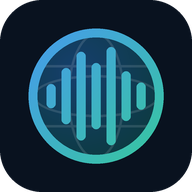
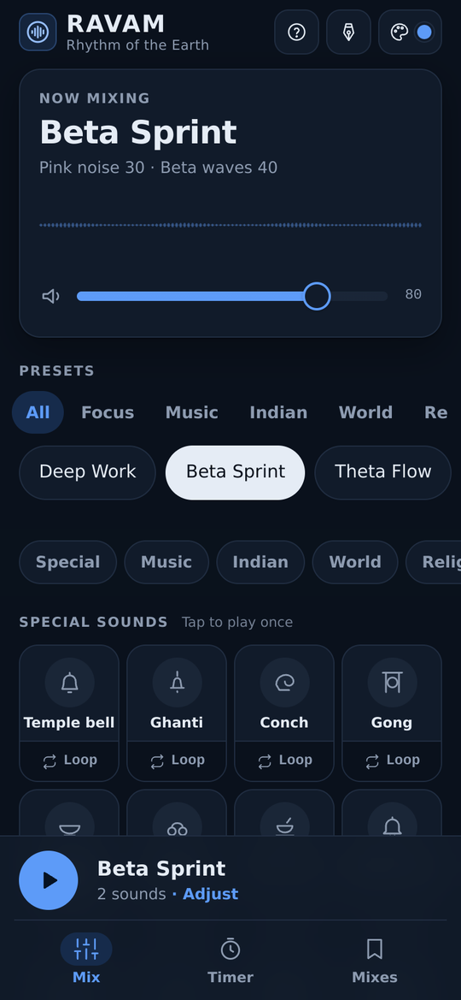
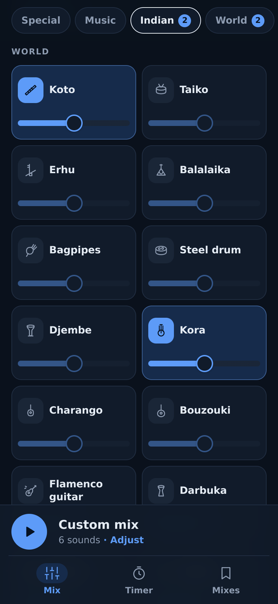
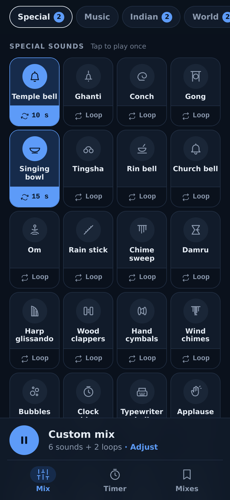
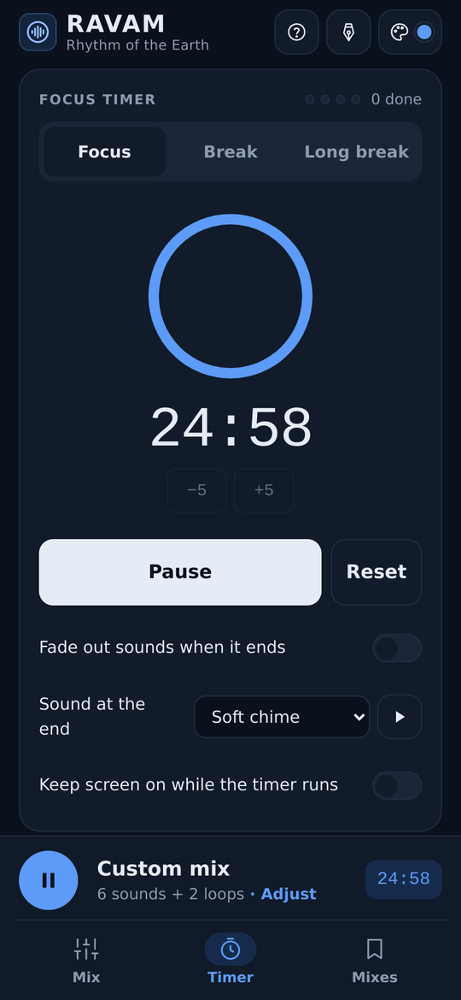
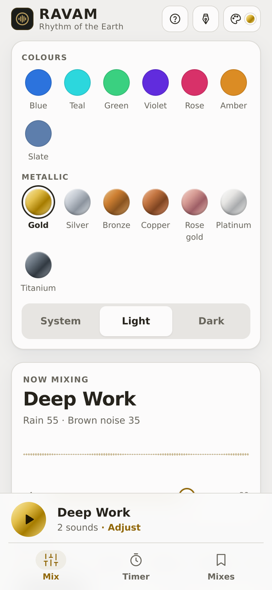
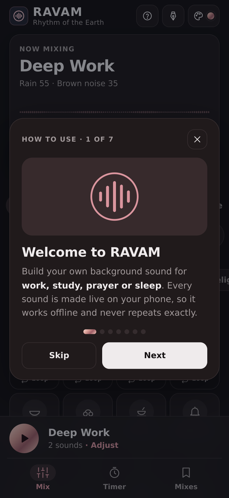

<div align="center">



# RAVAM

**Rhythm of the Earth**: a mobile-first ambient sound and music mixer for work, study, prayer and sleep.

[](#install-on-your-phone)
[](#how-it-works)
[](#how-it-works)
[](#project-structure)

**[▶ Open the live app](https://soorajacontec.github.io/ravam/)**

</div>

RAVAM lets you layer rain, Indian and world instruments, temple bells, focus noise and gentle music into your own soundscape, then run a focus timer on top. Every sound is **generated live in the browser** with the Web Audio API. There are no audio files to download, so it works fully offline once loaded, and it never plays exactly the same way twice.

| | | |
|:-:|:-:|:-:|
|  |  |  |
| **Mix and presets** | **World instruments** | **Special sounds and loops** |
|  |  |  |
| **Focus timer** | **Colour and metallic themes** | **Built-in how-to guide** |

## Features

- **193 sounds in 9 sections**, each with its own volume slider. Mix as many as you like.
- **272 one-tap presets**, filtered by Focus, Music, Indian, World, Religion, Old, Living and Nature.
- **24 special sounds**: a soundboard of one-shot sounds such as a temple bell, gong, conch or clock chime. Any of them can **loop every N seconds**.
- **Focus timer** with Focus, Break and Long break sessions, a choice of end sound, an optional fade-out and keep-screen-on.
- **Saved mixes**: name and keep your favourite combinations, including their loops.
- **Plays with the screen off.** On phones, the current mix keeps playing in the background.
- **14 colour themes**: 7 colours plus 7 metallic finishes (Gold, Silver, Bronze, Copper, Rose gold, Platinum, Titanium), each in light, dark or system mode.
- **Installable PWA**. It works offline, opens full-screen from the home screen, and needs no account.
- **Mobile-first and accessible**: big touch targets, a bottom tab bar on phones, keyboard support and reduced-motion support.
- **First-run "How to use" guide**, which can be reopened any time with the **?** button.

## Sound library

All music tracks share one tempo and key (72 BPM; Fmaj7, Em7, Dm9, Cmaj7), so melodic layers stay in tune with each other.

<details>
<summary><b>Background music</b> (29)</summary>

Lo-fi beats, Soft piano, Ambient pads, Kalimba, Acoustic guitar, Jazz lounge, Strings, Zen flute, Music box, Synth arps, Handpan, Bossa nova, Rhodes keys, Vibraphone, Harp, Cello, Choir, Marimba, Ukulele, Electric guitar, Ambient guitar, Smooth sax, Muted trumpet, Clarinet, Accordion, Felt piano, Warm bass, Soft drums, Chiptune
</details>

<details>
<summary><b>Indian instruments</b> (49): Hindustani, Carnatic, Kerala and folk</summary>

Tanpura, Sitar, Bansuri, Tabla, Santoor, Veena, Sarangi, Harmonium, Shehnai, Mridangam, Jal tarang, Swarmandal, Chenda, Edakka, Maddalam, Timila, Ilathalam, Kombu, Kuzhal, Mizhavu, Chengila, Sarod, Rudra veena, Esraj, Ektara, Pakhawaj, Dholak, Dhol, Nagada, Algoza, Manjira, Thudi, Udukku, Kuzhitalam, Pulluvan kudam, Nanthuni, Duff, Kaikottikali, Vallam kali, Nadaswaram, Thavil, Ghatam, Kanjira, Morsing, Carnatic violin, Gottuvadhyam, Venu, Parai, Urumi
</details>

<details>
<summary><b>World</b> (34)</summary>

Koto, Taiko, Shamisen (Japan) · Erhu, Pipa, Dizi (China) · Balalaika (Russia) · Bagpipes (Scotland) · Irish fiddle, Tin whistle, Bodhrán (Ireland) · Steel drum (Trinidad) · Djembe, Kora, Balafon, Talking drum (West Africa) · Charango, Cajón (Andes and Peru) · Bouzouki (Greece) · Flamenco guitar (Spain) · Darbuka, Qanun (Middle East) · Saz (Turkey) · Duduk (Armenia) · Banjo, Harmonica (USA) · Mandolin (Italy) · Angklung (Indonesia) · Morin khuur (Mongolia) · Alphorn (Switzerland) · Berimbau, Samba drums (Brazil) · Bandoneón (Argentina) · Steel guitar (Hawaii)
</details>

<details>
<summary><b>Religion</b> (20)</summary>

Temple bells, Om chant, Vedic chant, Aarti, Church bells, Bell ringing, Pipe organ, Gregorian chant, Gospel claps, Mosque courtyard, Ney flute, Daf, Prayer beads, Singing bowls, Zen temple, Tibetan horns, Throat chant, Prayer wheels, Shofar, Shinto shrine
</details>

<details>
<summary><b>Old instruments</b> (12)</summary>

Lyre, Oud, Frame drum, Lute, Harpsichord, Hurdy-gurdy, Glass harmonica, Didgeridoo, Pan flute, Guzheng, Shakuhachi, Gamelan
</details>

<details>
<summary><b>Living things rhythm</b> (12)</summary>

Heartbeat, Breathing, Honeybees, Purring cat, Woodpecker, Katydids, Koel, Cowbells, Horse trot, Whale song, Dolphins, Wolves
</details>

<details>
<summary><b>Workspace</b> (6) and <b>Outside the window</b> (16)</summary>

Office, Keyboard, Café, Desk clock, Fireplace, Fan · Rain, Thunder, Wind, Waves, Stream, Birds, Night, Rain on glass, Waterfall, Leaves, Cicadas, Frogs, Owl, Wind chimes, City traffic, Train ride
</details>

<details>
<summary><b>Focus noise</b> (15)</summary>

Brown, Pink, White, Grey, Dark brown, Green and Blue noise · Ocean noise, Cabin hum, Starship hum · Alpha, Beta, Gamma and Theta waves (binaural; use headphones) · Isochronic tones (work on speakers)

> Brainwave tones are offered as an optional listening style. Research on their effects is mixed.
</details>

<details>
<summary><b>Special sounds</b> (24): tap to play once, or loop every N seconds</summary>

Temple bell, Ghanti, Conch, Gong, Singing bowl, Tingsha, Rin bell, Church bell, Om, Rain stick, Chime sweep, Damru, Harp glissando, Wood clappers, Hand cymbals, Wind chimes, Bubbles, Clock chime, Typewriter bell, Applause, Level-up chime, Sparkle, Foghorn, Train whistle
</details>

Because everything is synthesised, instruments and animals are stylised impressions rather than recordings.

## How to use

1. **Tap a sound** to switch it on, and drag its slider to set the volume.
2. Or **tap a preset** for a ready-made mix. The tabs filter presets by category.
3. Press the round **play** button. On a phone, **Adjust** opens the list of what is playing.
4. Tap a **special sound** to hear it once, or tap **Loop** under it to repeat it every few seconds.
5. Open **Timer** for focus and break sessions. Save favourites under **Mixes**.
6. Change colours with the **palette** button, and tap **?** to see the guide again.

📽️ A Malayalam walkthrough is available as an animated GIF: [`docs/how-to-use-malayalam.gif`](docs/how-to-use-malayalam.gif)

## Install on your phone

Open the live app link, then:

- **Android (Chrome):** tap **Install** in the app header, or ⋮ menu → **Install app**.
- **iPhone (Safari):** Share → **Add to Home Screen**.

After the first visit, RAVAM opens and plays with no internet connection.

## Run locally

No build step and no packages are needed. Serve the folder over HTTP, because service workers don't run from `file://`.

```bash
# any one of these
npx serve .
python3 -m http.server 8000
```

Then open `http://localhost:3000` (serve) or `http://localhost:8000` (Python).

## Deploy to GitHub Pages

1. Push this folder to a GitHub repository, with `index.html` at the repository root.
2. Go to **Settings → Pages → Build and deployment**, choose **Deploy from a branch**, then pick `main` and `/ (root)`.
3. Wait about a minute, then open `https://YOUR-USERNAME.github.io/YOUR-REPO/`.
4. Replace the placeholder link at the top of this README with that address.

All paths in the app are relative, so it works from a sub-folder like `/YOUR-REPO/` without changes. The empty `.nojekyll` file tells GitHub Pages to serve the files as they are.

## How it works

- **One HTML file.** Markup, styles and all audio code live in `index.html`. There is no framework, bundler or dependency.
- **Synthesised audio.** Each sound is a small Web Audio "voice" built from oscillators, filtered noise, Karplus–Strong plucked strings, FM electric piano and formant-filtered "voices". A shared scheduler plays these on a common tempo grid, with a random element so the music keeps changing.
- **Screen-off playback.** Phones often pause live Web Audio when the screen locks. On mobile, RAVAM renders a seamless ~53-second loop of the current mix in the background using `OfflineAudioContext`, then hands it to an `<audio>` element when the page is hidden. Live audio resumes when you come back.
- **Offline.** `sw.js` caches the app shell on first load. Web fonts (Google Fonts) are cached on first use. Pages load network-first, so updates arrive when you are online.
- **Storage.** Settings, saved mixes, loops and theme are kept in `localStorage` on the device.

## Project structure

```
.
├── index.html              # the whole app: UI, styles and audio engine
├── manifest.webmanifest    # PWA name, colours and icons
├── sw.js                   # service worker (offline cache)
├── icons/                  # app icons (SVG, 192, 512, maskable, Apple touch)
├── docs/
│   ├── screenshots/        # images used in this README
│   ├── icon.png
│   └── how-to-use-malayalam.gif
└── .nojekyll               # serve files as-is on GitHub Pages
```

**After editing the app**, change `VERSION` in `sw.js` (for example `ravam-v31` to `ravam-v32`). This makes installed copies pick up the new version.

## Browser support

The app works in current Chrome, Edge, Safari and Firefox on Android, iOS and desktop.

- iPhone: if the ring/silent switch is on, Safari may mute web audio. Screen-off playback depends on iOS version and power settings.
- Binaural beats (Alpha, Beta, Gamma, Theta) need stereo headphones. Isochronic tones work on speakers.

## Privacy

RAVAM has no accounts, analytics, ads or tracking. Nothing you do leaves your device. The only network requests are for the web fonts and the app's own files.

## Credits

Created by **SSK-BLUM**.

## License

© 2026 SSK-BLUM. All rights reserved.
